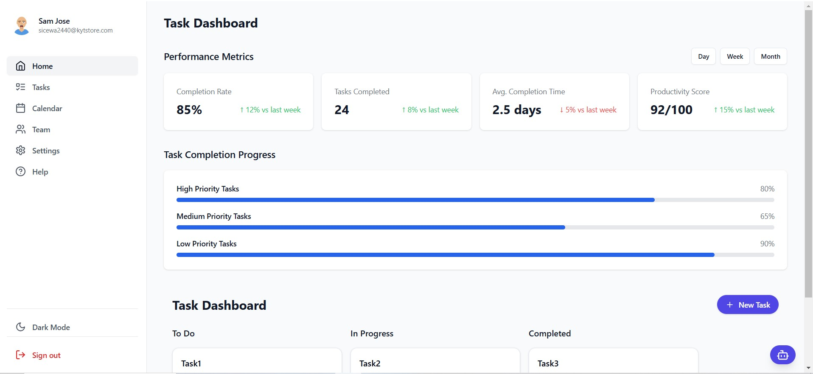
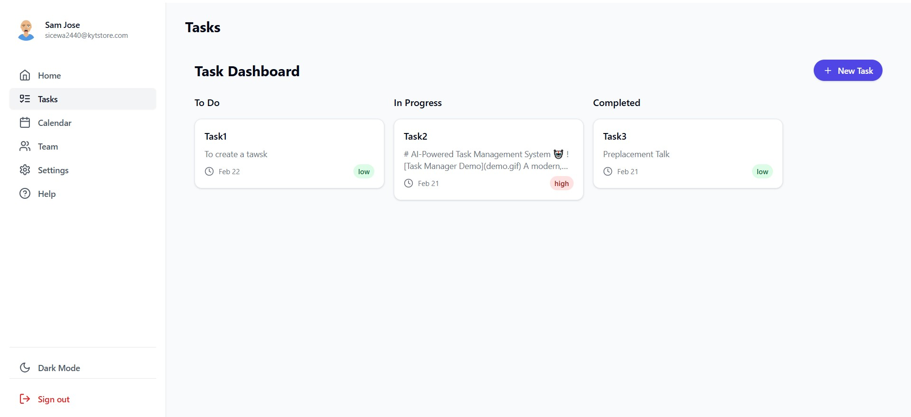
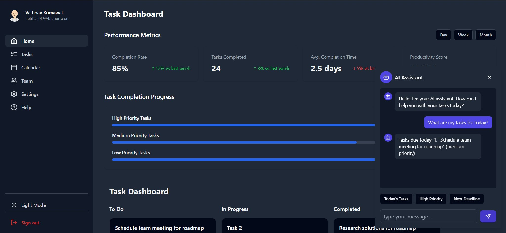

# AI-Powered Task Management System 🤖


A modern, AI-enhanced task management system built with React, TypeScript, and Supabase. Features an intelligent task organization system, real-time AI assistant, and intuitive Kanban board interface.

## 🌟 Live Demo

[](https://your-demo-link.com)

## ✨ Features

- 🤖 AI-powered task assistant
- 📊 Interactive dashboard with performance metrics
- 📋 Kanban board for task management
- 🔄 Real-time updates and collaboration
- 🎯 Task prioritization system
- 📱 Fully responsive design
- 🌙 Dark/Light mode support
- 🔐 Secure authentication

## 🛠️ Technologies

<div style="display: flex; gap: 20px; flex-wrap: wrap;">

[](https://reactjs.org/)
[](https://www.typescriptlang.org/)
[](https://tailwindcss.com/)
[](https://supabase.io/)
[](https://vitejs.dev/)

</div>

### Core Technologies
- **Frontend**: React 18 with TypeScript
- **Styling**: Tailwind CSS + Shadcn/ui
- **Backend**: Supabase
- **Build Tool**: Vite
- **State Management**: React Context + Hooks
- **Authentication**: Supabase Auth
- **Database**: PostgreSQL (via Supabase)

### UI Components
- **Component Library**: shadcn/ui
- **Icons**: Lucide Icons
- **Animations**: Framer Motion
- **Drag & Drop**: react-beautiful-dnd

## 🚀 Getting Started

### Prerequisites
- Node.js (v16+)
- npm or yarn
- Supabase account

### Installation

1. Clone the repository
```bash
git clone https://github.com/vaibhavk10/Ai-Task.git
cd Ai-Task
```

2. Install dependencies
```bash
npm install
```

3. Set up environment variables
```bash
cp .env.example .env
```

Add your Supabase credentials to `.env`:
```env
VITE_SUPABASE_URL=your_supabase_url
VITE_SUPABASE_ANON_KEY=your_supabase_anon_key
```

Supbase SQL Editor

```-- Drop existing table and policies
drop policy if exists "Enable read access for all users" on public.tasks;
drop policy if exists "Enable insert access for all users" on public.tasks;
drop policy if exists "Enable update access for all users" on public.tasks;
drop policy if exists "Enable delete access for all users" on public.tasks;
drop table if exists public.tasks;

create table public.tasks (
  id uuid default gen_random_uuid() primary key,
  title text not null,
  description text,
  status text not null default 'todo',
  due_date timestamp with time zone,
  assignee_id uuid references auth.users(id),
  created_by uuid references auth.users(id),
  created_at timestamp with time zone default now(),
  updated_at timestamp with time zone default now(),
  priority text default 'medium',
  comments_count integer default 0
);

-- Enable RLS
alter table public.tasks enable row level security;

-- Create policies
create policy "Users can view their own tasks"
  on public.tasks for select
  using (auth.uid() = created_by or auth.uid() = assignee_id);

create policy "Users can create tasks"
  on public.tasks for insert
  with check (auth.uid() = created_by);

create policy "Users can update their own tasks"
  on public.tasks for update
  using (auth.uid() = created_by);

create policy "Users can delete their own tasks"
  on public.tasks for delete
  using (auth.uid() = created_by);```

4. Start the development server
```bash
npm run dev
```

## 📱 Screenshots

### Dashboard View


### Task Management


### AI Assistant Interface


## 🏗️ Project Structure
```
src/
├── components/
│   ├── ui/          # Reusable UI components
│   ├── layout/      # Layout components
│   ├── kanban/      # Kanban board components
│   └── pages/       # Page components
├── contexts/        # React contexts
├── lib/            # Utility functions
├── services/       # API services
└── styles/         # Global styles
```

## 🔐 Authentication Flow

1. User signs up/logs in using email
2. Email verification sent for new accounts
3. JWT token stored securely
4. Protected routes and API calls

## 🎯 Key Features Explained

### AI Assistant
- Real-time task suggestions
- Natural language processing
- Context-aware responses
- Task optimization recommendations

### Task Management
- Drag-and-drop Kanban board
- Priority levels (High, Medium, Low)
- Due date tracking
- Progress monitoring

### Performance Analytics
- Task completion rates
- Productivity metrics
- Time tracking
- Progress visualization

## 🤝 Contributing

Contributions are welcome! Please read our [Contributing Guide](CONTRIBUTING.md) for details.

## 📄 License

This project is licensed under the MIT License - see the [LICENSE](LICENSE) file for details.

## 👥 Authors

- Vaibhav Kumawat - [GitHub](https://github.com/vaibhavk10/Ai-Task)

## 🙏 Acknowledgments

- [Shadcn/ui](https://ui.shadcn.com/) for the beautiful components
- [Supabase](https://supabase.io/) for the backend infrastructure
- [Tailwind CSS](https://tailwindcss.com/) for the styling system
